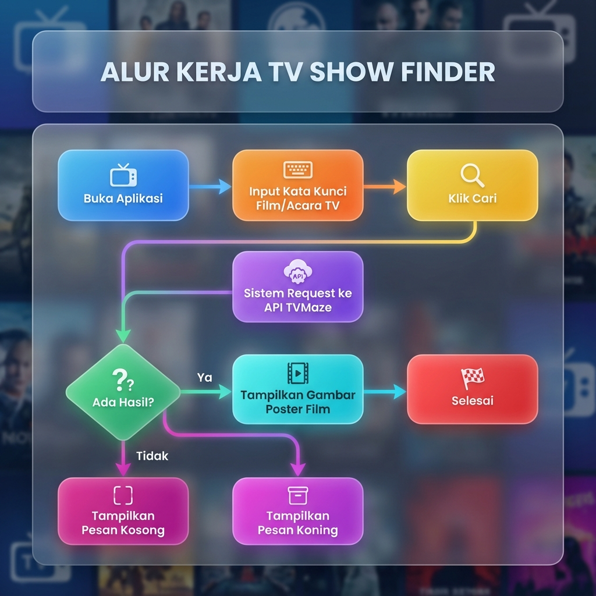
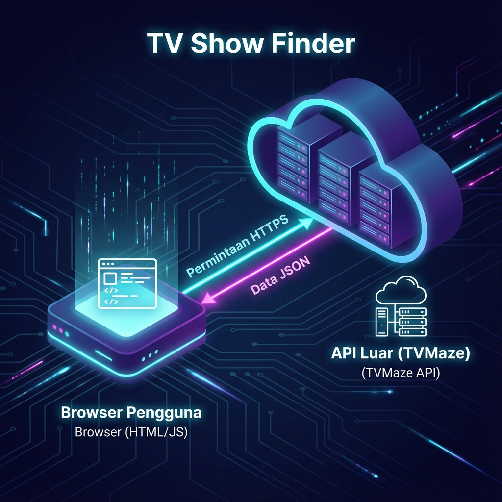

# Dokumentasi Use Case & Activity Flow - TV Show Finder

Proyek **TV Show Finder** adalah aplikasi berbasis web yang memungkinkan pengguna untuk mencari informasi acara TV menggunakan API dari TVMaze dan menampilkan poster/gambar dari acara tersebut.

## 1. Use Case

### Aktor
- **Pengguna**: Seseorang yang ingin mencari informasi atau poster acara TV.

### Deskripsi Use Case
| ID | Use Case | Deskripsi |
|---|---|---|
| UC1 | Mencari Acara TV | Pengguna memasukkan judul atau kata kunci acara TV ke kolom pencarian. |
| UC2 | Mengambil Data dari API | Sistem melakukan request ke API TVMaze dengan kata kunci yang diberikan. |
| UC3 | Menampilkan Poster Acara | Sistem merender gambar poster acara TV yang ditemukan ke halaman web. |
| UC4 | Mereset Pencarian | Sistem menghapus hasil pencarian sebelumnya setiap kali ada pencarian baru. |

---

## 3. Struktur Data

Aplikasi ini menggunakan data JSON yang diterima dari API TVMaze. Berikut adalah struktur data utama yang digunakan dalam aplikasi:

### Format Respons API (Array of Objects)
Sistem menerima array yang berisi beberapa objek hasil pencarian. Setiap objek memiliki properti utama yaitu `show`.

```json
[
  {
    "score": 0.89,
    "show": {
      "id": 123,
      "url": "https://www.tvmaze.com/shows/123/name",
      "name": "Nama Acara TV",
      "type": "Scripted",
      "language": "English",
      "image": {
        "medium": "https://static.tvmaze.com/uploads/images/medium_portrait/1/1.jpg",
        "original": "https://static.tvmaze.com/uploads/images/original_untouched/1/1.jpg"
      },
      "summary": "<p>Ringkasan acara TV...</p>"
    }
  }
]
```

### Atribut Utama yang Digunakan:
- **`show.name`**: Digunakan sebagai identitas atau judul acara (opsional untuk tampilan).
- **`show.image.medium`**: URL gambar poster berukuran sedang yang ditampilkan langsung ke dalam elemen `` di browser.
- **`show.image`**: Dilakukan pengecekan (`if(result.show.image)`) untuk memastikan data gambar tersedia sebelum mencoba menampilkannya, guna menghindari error broken image.

## 2. Activity Flow (Flowchart)

Berikut adalah alur aktivitas pengguna dalam aplikasi TV Show Finder:



### Penjelasan Flow:
1. **Inisialisasi**: Pengguna membuka halaman "TV Show Finder".
2. **Input**: Pengguna mengetik nama acara TV (misal: "Stranger Things") di kolom input.
3. **Proses Cari**: Pengguna menekan tombol "Find" atau menekan Enter.
4. **Request API**: Aplikasi mengirimkan permintaan ke API TVMaze (`api.tvmaze.com`).
5. **Output**:
    - Jika ada hasil, sistem akan menampilkan daftar poster acara TV yang relevan.
    - Jika tidak ada hasil atau gambar tidak tersedia, sistem tidak menampilkan apa pun untuk item tersebut.
---

## 4. Arsitektur Sistem

Aplikasi **TV Show Finder** menggunakan arsitektur *Client-Server* sederhana di mana logika utama berjalan di sisi klien (browser).



### Komponen Arsitektur:
1.  **Frontend (Browser Pengguna)**: 
    -   Menggunakan **HTML5** untuk struktur interface.
    -   Menggunakan **Axios** (JavaScript) untuk mengelola komunikasi asinkron.
    -   Bertanggung jawab untuk menangkap input pengguna dan merender hasil pencarian.
2.  **External API (TVMaze)**:
    -   Bertindak sebagai penyedia data utama.
    -   Menerima permintaan pencarian melalui protokol HTTPS.
3.  **Protokol Komunikasi**:
    -   Pertukaran data dilakukan menggunakan **REST API** dengan format respons **JSON**.
    -   Komunikasi bersifat stateless antar browser dan server API.
